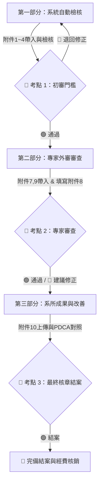

# 輔英科技大學「課程結構外審」全流程自動檢核與考點審核系統

本系統依據《輔英科技大學高等教育深耕計畫課程結構外審作業規範》與《科目表制定及課程開設要點》（附件6）規範開發，提供全自動化檢核、跨表比對、三階段邏輯流程與三考點（Gate 1, Gate 2, Gate 3）審核機制。

---

## 🚀 網頁連結與 GitHub Pages
- **GitHub Pages 預覽網址**：[https://laisiff-dev.github.io/COURSE-CHECK/](https://laisiff-dev.github.io/COURSE-CHECK/)
- **原始碼 Remote 倉庫**：`git@github.com:laisiff-dev/COURSE-CHECK.git`

---

## 🎯 核心功能與三階段邏輯

### 1. 第一部分：系統自動檢核階段 (附件1~4 & 附件5)
- **附件6要點條文自動檢核**：
  - 專業必選修學分比例（$\text{必修} \le \text{選修} \times 2$）
  - 健康主軸特色課程（10% 門檻）
  - 資訊學群/程式設計 (2學分)、職場英文 (2學分)、數位科技 (2學分)、服務學習必修
  - 職場專業倫理 (2學分必修) 與 總結性課程高年級開設限制
  - 四技第四學年不排普通必修課限制
- **五大文件跨表一致性比對**：附件2科目表 vs 附件3大綱資料 vs 附件4核心能力關聯表 vs 附件7專家簡歷。
- **產出附件5報表**：100% 等比例還原《附件5 科目表檢核表》之公文表格與動態勾選框。
- **📌 考點 1 人工審核門檻**：初審人員可執行 `[🟢 審核通過送出]` 或 `[🔴 退回系所修正]`。

### 2. 第二部分：專家外審審查階段 (附件7, 9 & 附件8)
- **附件8 課程結構審查意見表**：專家參考自動檢核結果填寫量化評定與質性意見。
- **附件9 個資同意書**：專家帳戶與簽章檔回傳。
- **📌 考點 2 人工審核門檻**：專家委員執行 `[🟢 審查通過]` 或 `[🔴 建議修正/退回]`。

### 3. 第三部分：系所成果與改善對照階段 (附件10)
- **附件10 成果報告書**：PDCA 執行成果摘要填報與【審查意見 vs 系所回應改善對照表】。
- **📌 考點 3 人工審核門檻**：教務處/院級最終核章 `[🟢 准予結案]` 或 `[🔴 退回重新改善]`。

---

## 📂 檔案結構說明

- `index.html`：主系統網頁介面。
- `css/style.css`：質感 UI 設計系統與全表件列印樣式 (`@media print`)。
- `js/auditor.js`：核心自動檢核與跨表比對邏輯引擎。
- `js/sampleData.js`：預設全流程示範資料庫 (附件1~10 護理系與高齡照護系範例)。
- `js/app.js`：UI 互動控制、考點 Gate 1/2/3 邏輯處理與附件5/8/9/10動態報表生成器。

---

## ⚙️ 啟用 GitHub Pages 步驟
1. 進入 GitHub 倉庫頁面：[https://github.com/laisiff-dev/COURSE-CHECK](https://github.com/laisiff-dev/COURSE-CHECK)
2. 點擊 **Settings** ➔ **Pages** (位於左側選單)。
3. 在 **Build and deployment** ➔ **Source** 選擇 `Deploy from a branch`。
4. 在 **Branch** 選項選擇 `main` / `/(root)` 並點擊 **Save**。
5. 等待 1~2 分鐘，即可透過 `https://laisiff-dev.github.io/COURSE-CHECK/` 存取網頁！
